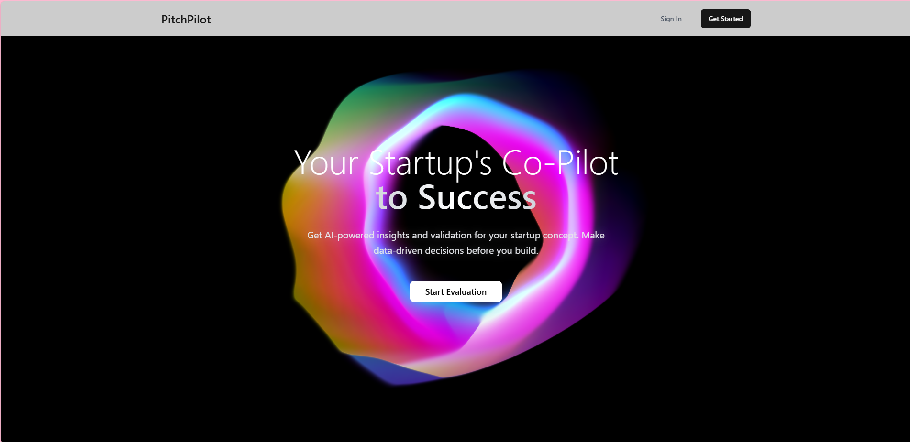
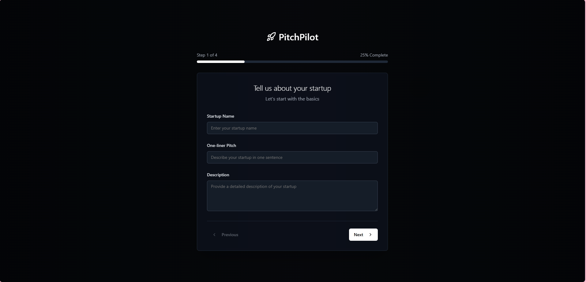
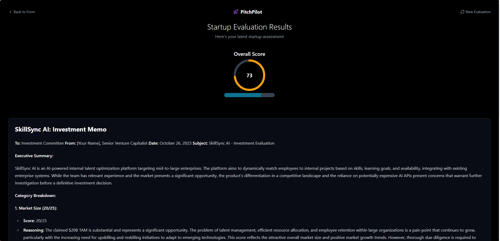
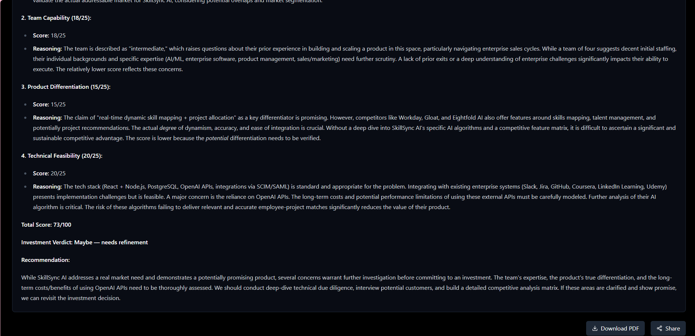

# PitchPilot 🚀

**PitchPilot** is a full-stack web application that acts as your startup’s co-pilot—offering AI-powered evaluation, scores, and VC-style investment memos based on key success factors. Designed for founders, by founders.

---

## 🌟 Features

- **Landing Page**: Hero messaging, “Start Evaluation” CTA, sign-in/out, and results access.
- **Informational Sections**: Market Analysis, Feasibility Check, Growth Potential.
- **Multi-Step Form** (4 steps): 
  - Step 1: Basic info – name, one-liner pitch, description  
  - Subsequent steps: market, team, tech, and differentiation inputs.
- **AI Evaluation**: Gemini API processes responses to generate:
  - ✅ Overall Score (0–100) visualized via progress dial
  - 📌 Detailed Investment Memo with category breakdown (Market, Team, Product, Tech)
- **Download & Share**: Users can download results as PDF or share via link.

---

## 🛠️ Tech Stack

| Area          | Technology                       |
|---------------|----------------------------------|
| Frontend      | React + Tailwind CSS (dark/light themes) |
| Backend       | Firebase: Auth + Firestore       |
| AI Evaluation | Gemini API                       |
| Hosting       | Vercel / Netlify (recommended)   |

---

## 🧠 How It Works

1. **User Journey**: Sign in → Click “Start Evaluation” → Complete 4-step form.
2. Data sent to **Gemini API** through backend.
3. Receive:
   - **Overall Score** (displayed via dial)
   - **VC‑style memo** with insights and recommendations.
4. Users can **download PDF** or **share results** with others.

---

## 🚀 Quick Start

```bash
# 1. Clone the repo
git clone https://github.com/your-username/pitchpilot.git
cd pitchpilot

# 2. Install dependencies
npm install

# 3. Set up .env
echo "VITE_GEMINI_API_KEY=your_gemini_key" >> .env
echo "VITE_FIREBASE_API_KEY=your_firebase_key" >> .env
echo "VITE_FIREBASE_PROJECT_ID=your_firebase_project_id" >> .env

# 4. Start development server
npm run dev
```
## 📁 Project Structure

pitchpilot/
├── public/
├── src/
│   ├── components/        # reusable UI modules
│   ├── pages/             # multi-step form & results
│   ├── firebase/          # Firebase config & helpers
│   ├── App.jsx
│   └── main.jsx
├── .env
├── .gitignore
├── README.md
└── package.json

## 🖼️ Screenshots

### 🔹 Home Page


## 🔹 Results Page


### 🔹 Results Page



## 💡 Contributing
Have ideas or improvements? Want to add more evaluation dimensions or tweak UI themes? Contributions are welcome—fork and open a PR!

## 👨‍💻 Author
Rohit Narwaar • GitHub Profile


